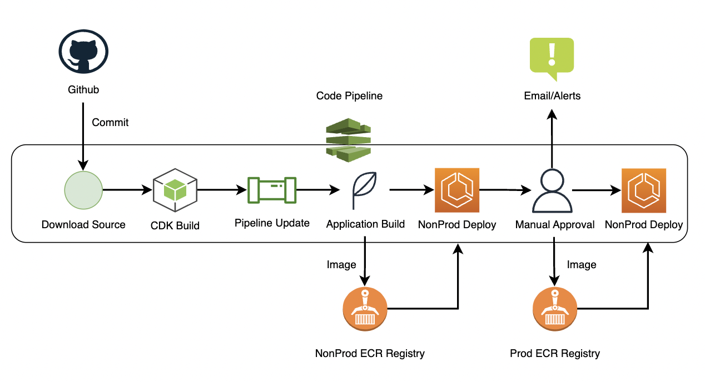

# Demo API

This stack contains constructs to create infrastructure and deployment for the Demo API.
Customize this stack by adding or removing the constructs which may or may not be needed for your use cases.

** Some of the AWS resources which are created by this stack are not covered under AWS Free tier. **

-----

## Description

    This project deploys a simple flask application on AWS ECS with a Load Balancer. The application accepts POST request with a file, uploads it to the S3 bucket and returns the object key in the response.

## Stacks

* Demo API stack
* Demo API Pipeline stack

-----

## Architecture  

-----

### <i> Pipeline </i> 

-----
### <i> Application </i>   

-----

## Prerequisites

* Refer "[aws-prerequisites](https://github.com/tsk811/aws-prerequisites)" and "[aws-infra](https://github.com/tsk811/aws-infra)"project for the required setup.
* Update the account IDs and relevant configurations under "lib/configuration"
-----

## How to

1. Deploy "DemoPipelineStack" from local for the first time(one time activity).
2. Pipeline will checkout the code from Github repo for every new push to the default branch(main).
3. CDK Build stage prepares the templates for pipeline and application infrastructure.
4. Self Mutate stage will alter the pipeline configuration if there are any changes.
5. Application will be then deployed to Non Prod account.
6. Manual approval stage will be used for Production deployment approval along with a notification to required groups(Email).
7. Application will be then deployed to Prod account after approval.

Open the Code Pipeline to visualize the flow after the pipeline deployment for better understanding.

-----

## Resources

* Fargate Service
* Task Definition
* Application Load Balancer(ALB)
* ALB listener
* ALB Target Group
* Auto Scaling configuration for Fargate service
* A sample lambda

-----

### Notes

* Rolling deployment is used for new app versions. Code Deploy / ECS deploy is not used as it will require their own Code build/deploy projects to be available before the pipeline deployment itself.
* New Docker images will be tagged with "latest" and the Code Commit SHA tags to maintain the versions.
